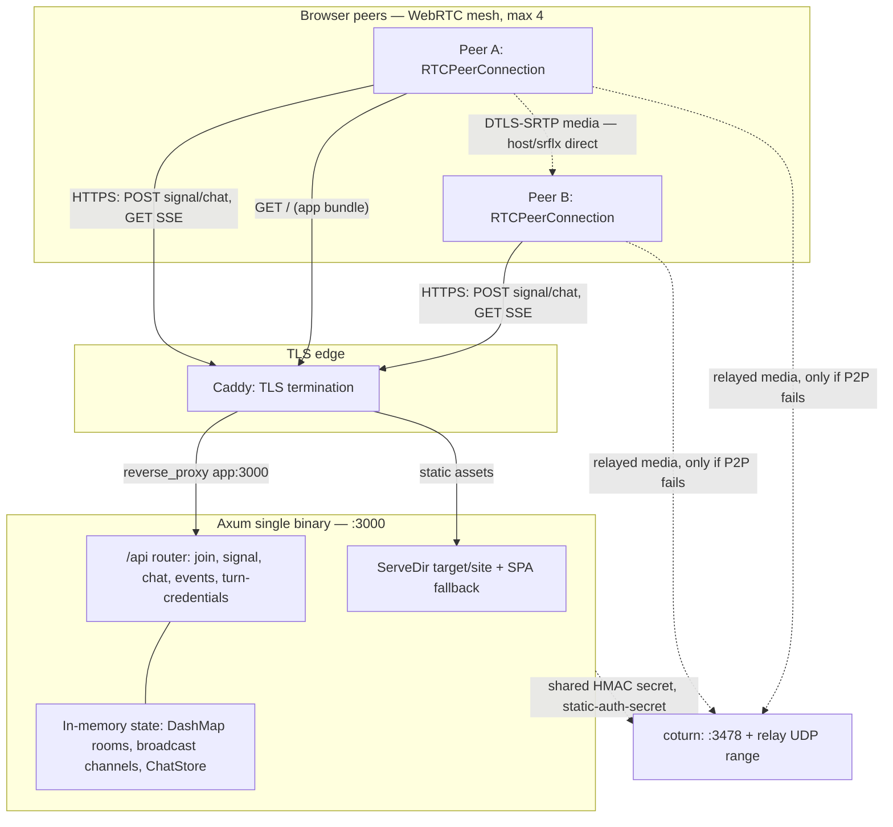
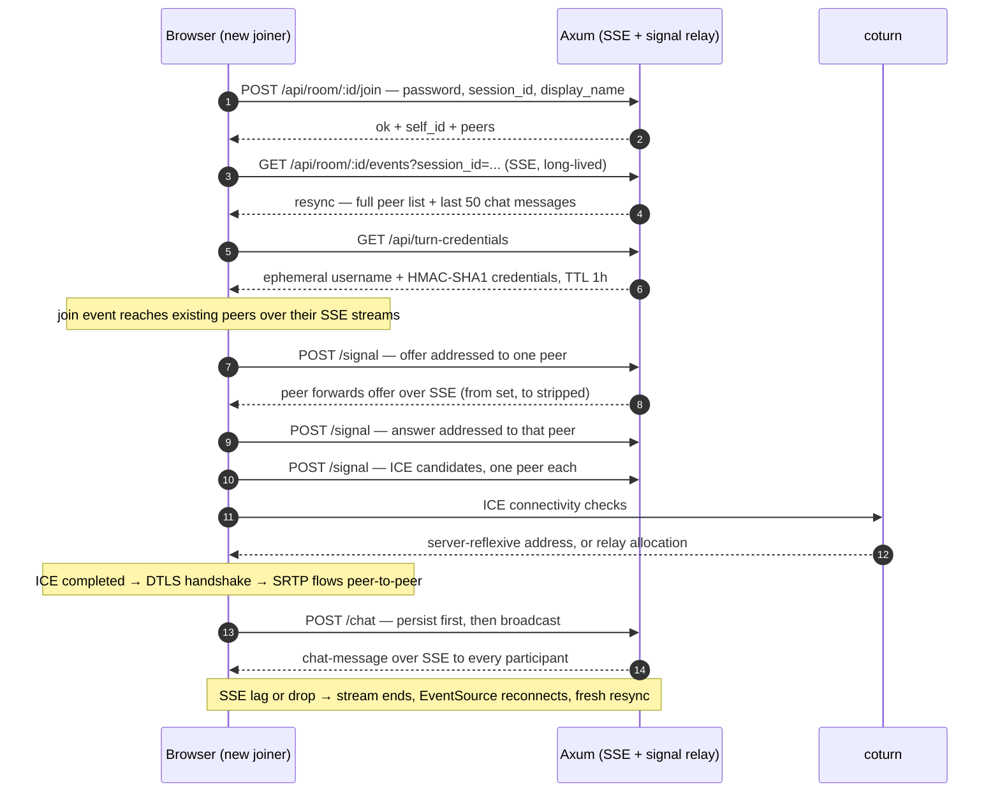

# Pico sized RTC chat Room

Explore the ability to create a really small and easy deployable chat and video chat system. This should be possible using WebRTC for most 
client side video handling, supported by a simple and light weight backend service.

Using modern standards and single binary rust (Axum + Leptos), SSE signaling, no WebSockets.

## Quick Start (Dev)

### Prerequisites

- Rust 1.85+ (edition 2024)
- [cargo-leptos](https://github.com/leptos-rs/cargo-leptos) — `cargo install cargo-leptos`
- [wasm32 target](https://rustwasm.github.io) — `rustup target add wasm32-unknown-unknown`
- `wasm-bindgen-cli` **matching the pinned `wasm-bindgen` version** in `Cargo.toml`
  (`=0.2.128`): `cargo install -f wasm-bindgen-cli --version 0.2.128`. cargo-leptos uses
  whichever `wasm-bindgen` is on `PATH`, and a schema mismatch fails the wasm build.
- [coturn](https://github.com/coturn/coturn) — `apt install coturn` (or Docker)

### Run Dev Server

```bash
# Builds the wasm client + Axum server, runs both, rebuilds on change.
# cargo-leptos also refreshes the browser tab for you (its own loopback reload
# server on :3001) — dev tooling only, never part of the app.
cargo leptos watch
```

Open http://localhost:3000, navigate to a room like `/room/my-test`, set a password, share the link.

One-shot alternative (build then run, no watching): `cargo leptos serve`.

The server binds the `site-addr` from `[package.metadata.leptos]` in `Cargo.toml`
(default `127.0.0.1:3000`) and serves the built client from `site-root`
(`target/site`, regenerated on every build — never hand-edit it).

### TURN (Optional for Dev)

For local testing on the same machine or same NAT, STUN alone is sufficient.
For testing across NATs:

```bash
# Edit turnserver.conf, then:
turnserver -c turnserver.conf
```

Or Docker:

```bash
docker run -d --network=host \
  -v $(pwd)/turnserver.conf:/etc/coturn/turnserver.conf \
  coturn/coturn
```

## Production Deployment

### Architecture

Two planes, deliberately kept apart: the server only ever touches **signaling and
chat** — media goes browser-to-browser, and touches coturn only when ICE decides
it must.

#### Topology



#### Signaling flow



### Build

```bash
# Client (wasm) + server binary in one invocation; output lands in target/site
cargo leptos build --release
```

To run the release server standalone (outside cargo-leptos), point it at the built
site — it reads these on startup and otherwise falls back to the same defaults:

```bash
LEPTOS_OUTPUT_NAME=webrtc-room \
LEPTOS_SITE_ROOT=target/site \
LEPTOS_SITE_ADDR=0.0.0.0:3000 \
./target/release/webrtc-room
```

The binary is named `webrtc-room` (matching the package name) because cargo-leptos
locates the built executable at `target/<profile>/<package-name>`.

### Deploy Checklist

1. **TLS is mandatory** — WebRTC requires a secure context (`https://`)
2. Place Caddy or Nginx in front of the Axum binary for TLS termination
3. Run coturn on the same host (or a nearby one) to minimize relay latency
4. Set environment variables:
   - `TURN_HOST` — public hostname of TURN server
   - `TURN_SECRET` — shared secret for ephemeral HMAC credentials (must match `static-auth-secret` in `turnserver.conf`)
   - `TURN_PORT` — usually `3478`
   - `LEPTOS_SITE_ADDR=0.0.0.0:3000` — the dev default binds loopback only, which is unreachable from inside a container
   - `LEPTOS_SITE_ROOT` / `LEPTOS_OUTPUT_NAME` — where the built client lives, and its file stem
5. Open UDP ports `3478` (TURN/STUN) and `49152-65535` (relay range) on firewall

### Docker Compose (Full Stack)

```yaml
services:
  app:
    build: .
    ports:
      - "3000:3000"
    environment:
      - TURN_HOST=turn.example.com
      # Must match `static-auth-secret` in turnserver.conf. Change both for production.
      - TURN_SECRET=dev-secret-change-me
      - TURN_PORT=3478
      # Where the built client is, and which address to bind (loopback would be
      # unreachable from the proxy container).
      - LEPTOS_SITE_ROOT=/srv/site
      - LEPTOS_SITE_ADDR=0.0.0.0:3000
      - LEPTOS_OUTPUT_NAME=webrtc-room
    restart: unless-stopped

  coturn:
    image: coturn/coturn
    network_mode: host
    volumes:
      - ./turnserver.conf:/etc/coturn/turnserver.conf
    restart: unless-stopped

  caddy:
    image: caddy:2
    ports:
      - "80:80"
      - "443:443"
    volumes:
      - ./Caddyfile:/etc/caddy/Caddyfile
      - caddy_data:/data
    restart: unless-stopped

volumes:
  caddy_data:
```

### Caddyfile

```
yourdomain.com {
    reverse_proxy app:3000
}
```

(Inside Docker Compose the app service is reachable as `app`; for a bare
host use `reverse_proxy localhost:3000`.)

### coturn Config (turnserver.conf)

```conf
listening-port=3478
realm=turn.yourdomain.com

# Auth — use use-auth-secret for ephemeral HMAC
use-auth-secret
static-auth-secret=change-me-to-random-hex

# Relay range
min-port=49152
max-port=65535

# IPs
external-ip=YOUR_PUBLIC_IP

# Logging
log-file=/var/log/turnserver.log
verbose
```

## Project Structure

A single crate holds both halves. cargo-leptos builds the `lib` target to wasm
(`--no-default-features --features=csr`) and the `webrtc-room` bin target
natively (`--no-default-features --features=ssr`), so `csr` and `ssr` never meet
in one compilation. There is no Trunk and no committed `index.html` — the server
writes the shell into `target/site` at startup.

```
pico-rtc/
├── README.md               # This file
├── Cargo.toml              # Crate + [package.metadata.leptos]
├── rust-toolchain.toml
├── turnserver.conf         # coturn config template
├── Caddyfile               # Reverse proxy template
├── Dockerfile
├── .dockerignore           # Keeps target/ out of the build context
├── docker-compose.yml
├── .github/
│   └── workflows/
│       └── ci.yml          # clippy + tests + build + docker, four jobs
├── .config/
│   └── nextest.toml        # The `ci` profile that makes nextest emit JUnit
├── scripts/
│   ├── ci-tools.sh         # Installs pinned cargo-leptos / wasm-bindgen / Dart Sass
│   ├── check-bundle.sh     # Asserts the artifact: Pico in, WebSocket out
│   ├── api.test.mjs        # HTTP-level assertions against a running server
│   ├── ui.test.mjs         # The browser assertions, driven over CDP
│   ├── ui-smoke.sh         # Launcher: headless Chromium with fake media devices
│   └── lib/
│       └── browser.mjs     # Minimal CDP client (tabs, input, room state)
├── src/
│   ├── lib.rs              # Module gates + the wasm `hydrate()` entry point
│   ├── types.rs            # Shared request/response/event types (both targets)
│   ├── app.rs              # Leptos <App> (wasm only)
│   ├── bin/
│   │   └── server.rs       # Axum main + the HTML shell it writes at startup
│   ├── pages/
│   │   ├── mod.rs
│   │   ├── home.rs         # Landing: enter room name
│   │   └── room.rs         # Stage, controls, chat overlay, join flow
│   ├── server/
│   │   ├── mod.rs          # Router assembly + join/SSE/signal/chat handlers
│   │   ├── rooms.rs        # Room state, participant tracking
│   │   ├── chat.rs         # ChatStore trait + InMemoryChat ring buffer
│   │   ├── turn.rs         # Ephemeral TURN credential generation
│   │   └── auth.rs         # Room password check (trait for future auth)
│   ├── services/
│   │   ├── mod.rs
│   │   ├── signaling.rs    # Client: SSE consumer + signal sender
│   │   ├── webrtc.rs       # Client: RTCPeerConnection mesh (one PC per peer)
│   │   └── audio_level.rs  # Client: per-peer loudness -> dominant speaker
│   └── components/
│       ├── mod.rs
│       ├── video_tile.rs   # One <video>, its caption, and whether it holds the stage
│       └── controls.rs     # Media toggles, stage mode, chat toggle and badge
└── style/
    ├── main.scss           # Stylesheet entry: Pico, then the app's own rules
    └── pico/               # PicoCSS 2.x Sass sources, vendored (do not hand-edit)
```

Build output (gitignored): `target/site/{index.html,pkg/*}` for the site, and
`target/front/` for the separate wasm target dir cargo-leptos uses.

### Styling

PicoCSS 2.x is **vendored** under `style/pico/` — the Sass sources, not the compiled
css. `style/main.scss` loads it and then adds the app's rules, and cargo-leptos
compiles that one file into `target/site/pkg/webrtc-room.css` with Dart Sass before
Lightning CSS retargets it. Nothing is fetched from a CDN, so the room works offline
and the origin is the only host the page talks to.

Pico lives inside `style/` rather than beside it because cargo-leptos passes **no sass
load paths** to `sass` — partials only resolve relative to the entry file.

Two consequences worth knowing:

- `sass` comes from `PATH` if there is one; otherwise cargo-leptos downloads a pinned
  Dart Sass on first build. Anything from 1.8x up works — Pico's helpers need
  `color.channel()` and `map.deep-merge()`.
- Pico's knobs are plain Sass variables (`$theme-color`, `$enable-*`) in
  `style/pico/_settings.scss`; the `--pico-*` names are the CSS custom properties it
  *emits*. The app's rules use those properties, so the accent colour and dark mode
  still drive everything. Pico only emits ~20 `!important` declarations (form
  validation and reduced-motion), so ordinary specificity is enough to override it.

## Room UI

The stage is a `1fr 4fr` grid: a narrow strip for your own mirrored feed, four fifths
for the room. Which remote feed owns that space is decided client-side:

- **Speaker mode** (default) shows one remote feed — the loudest, measured from an
  `AnalyserNode` tapped on the same `MediaStream` the `<video>` already plays, so no
  audio is duplicated. A challenger has to be 1.6x louder to take the stage, and a
  quiet room falls back to a stable pick rather than an empty tile.
- **Gallery mode** shows every feed at equal size.
- **Under 640px** it is always a gallery, and the mode toggle is hidden: a phone held
  next to a face has neither width for the split nor patience for a 20% tile.

Chat is a fixed overlay rather than a column, so it costs the feeds no width. Closed,
it takes no space and holds no focus, and its toggle carries a badge counting whatever
arrived while it was shut; opening the overlay is what clears the count.

The three media toggles are the one part of the bar that does nothing yet: they flip
their own pressed state, not the tracks behind them (see the roadmap).

One dev caveat: browsers park an `AudioContext` until the page has had a user gesture,
and a parked context reads as silence. Until something is clicked, speaker mode keeps
its fallback pick. `--autoplay-policy=no-user-gesture-required` removes the wait when
you are driving the page from a script.

## Tests & CI

`.github/workflows/ci.yml` runs on every push and pull request, as four jobs in
increasing order of how much of the system they touch:

| Job      | What it proves                                                                  |
| -------- | ------------------------------------------------------------------------------- |
| `server` | Native clippy with `-D warnings`, plus the unit tests (auth, rooms, addressing) |
| `client` | Clippy for the wasm half, which only compiles for `wasm32`                      |
| `build`  | `cargo leptos build`, assertions on the artifact, then the API + browser suites |
| `docker` | Builds the image and runs the same API suite against the container              |

`docker` is the slow one — it builds `--release` from scratch with a cold layer
cache. Everything else is fast enough to keep green.

### Running them here

```bash
sh scripts/ci-tools.sh                          # pinned cargo-leptos, wasm-bindgen, Dart Sass
cargo leptos build && sh scripts/check-bundle.sh

cargo test --features ssr                       # as always
cargo nextest run --features ssr --profile ci   # same tests, plus target/nextest/ci/junit.xml

target/debug/webrtc-room &                      # writes target/site/index.html on startup
node --test scripts/api.test.mjs                # real handlers over HTTP
sh scripts/ui-smoke.sh 3                        # headless Chromium, three peers, fake cameras
```

`check-bundle.sh` is where the SSE-only rule gets enforced mechanically: it fails
if the built client mentions `WebSocket` or contains a `ws://`/`wss://` literal,
and also if `EventSource` is *missing* from it. It matches on the scheme rather
than a bare `ws:` because that substring occurs inside ordinary words such as
`rows:`.

### JUnit reports

Every suite emits JUnit XML, and CI publishes it as check runs, so a failure is
one named red test rather than a paragraph of log text to squint at.

| Suite           | Runner                             | Report                        |
| --------------- | ---------------------------------- | ----------------------------- |
| Rust unit tests | `cargo nextest --profile ci`       | `target/nextest/ci/junit.xml` |
| HTTP/API        | `node --test`, built-in reporter   | `reports/api-junit.xml`       |
| Browser         | `node --test`, started by the shim | `reports/ui-junit.xml`        |

Two constraints explain the shape of this:

- **`cargo test` cannot do this on stable.** Its machine-readable output needs
  `-Z unstable-options`, which the compiler refuses on a stable toolchain, and
  this project pins stable. `cargo-nextest` emits JUnit natively and is a test
  runner rather than a dependency: `Cargo.toml` is untouched and `cargo test`
  still works for anyone who does not want the extra binary.
- **The JS suites use `node:test`.** Node ships a runner *and* a JUnit reporter,
  so the repository still has no `package.json` and no `node_modules`, and the
  browser is driven over raw CDP (`scripts/lib/browser.mjs`) instead of
  Puppeteer — which would have meant downloading a browser in order to test one.

Test *titles* deliberately contain no per-run values (room name, base URL): the
room is logged instead. JUnit consumers key a test's history on its name, so a
per-run value in a title gives every CI run a brand-new test with nothing to
compare against.

Playwright is the sensible upgrade the day these suites want real auto-waiting,
traces, or screenshots on failure. It costs an npm project and a browser
download per runner, which is exactly the weight this arrangement avoids.

Two deliberate omissions, so nobody has to rediscover them:

- **No `cargo fmt --check` gate.** The tree has pre-existing formatting drift, so
  the gate would fail for reasons unrelated to the change under review. Run
  `cargo fmt` once to sweep, then it is one step to add.
- **The browser suite is advisory** (`continue-on-error: true`). WebRTC with fake
  devices can flake on shared runners, and a red X that means "sometimes" trains
  people to ignore red Xes. It passes reliably on a workstation; delete that line
  to make it voting once it has held on real runners. Its JUnit report is
  published either way, which is how you can watch it before promoting it.

## API Reference

All endpoints under `/api/`.

### `POST /room/:id/join`
Join (or claim) a room.

```json
// Request
{
  "password": "optional-existing-pw",
  "claim_password": "set-on-first-visit",
  "session_id": "uuid-from-sessionStorage",
  "display_name": "Alice",
  "user_id": "cookie-stable-id"
}

// Response
{"status": "ok", "self_id": "...", "peers": ["..."], "chat": [...]}
{"status": "need-password"}       // room is new, you must set one
{"status": "password-required"}   // wrong password
{"status": "full"}                // room at capacity
```

### `POST /room/:id/signal?session_id=...`
Relay one WebRTC signaling message (offer/answer/ICE) to **one** peer. Requires
the `session_id` of an active participant (otherwise `400`/`403`).

Every media signal is **addressed** with `to`, even though the transport is a
room-wide SSE channel: a peer that applies an offer, answer or candidate meant
for someone else silently corrupts the single `RTCPeerConnection` it holds for
the sender. The server relays to `to` only, and rewrites `to` into `from`. If
that participant has already left, the signal is dropped and the request still
returns `200`: the pair is rebuilt from the next `resync`.

```json
{"type": "offer", "to": "peer-session-id", "sdp": "..."}
{"type": "answer", "to": "peer-session-id", "sdp": "..."}
{"type": "ice-candidate", "to": "peer-session-id", "candidate": "...", "sdp_mid": "...", "sdp_mline_index": 0}
```

### `GET /room/:id/events?session_id=...`
SSE stream. **Requires the `session_id` of an active participant** (as issued
by the join flow) — otherwise `400`/`404`/`403`. Event data (JSON, no
`event:` field — parse `data:`):

```json
{"event": "resync", "peers": [{"peer_id": "...", "peer_name": "Alice"}], "chat": [...]}
{"event": "peer-joined", "peer_id": "...", "peer_name": "Alice"}
{"event": "peer-left", "peer_id": "..."}
{"event": "offer", "from": "...", "sdp": "..."}
{"event": "answer", "from": "...", "sdp": "..."}
{"event": "ice-candidate", "from": "...", "candidate": "...", "sdp_mid": "...", "sdp_mline_index": 0}
{"event": "chat-message", "from": "...", "sender_name": "...", "text": "...", "timestamp_ms": 123}
```

A `resync` event (full room state: peers + last 50 chat messages) is sent on
every (re)connect, so clients can heal any gap after join or a reconnect.

### `POST /room/:id/chat?session_id=...`
Send a chat message (persisted, broadcast via SSE). Requires the `session_id`
of an active participant.

```json
{"text": "hello", "sender_name": "Alice"}
```

### `GET /room/:id/chat/history?session_id=...`
Last 100 chat messages for the room. Requires the `session_id` of an active
participant.

### `GET /turn-credentials`
Ephemeral TURN/STUN credentials (HMAC-SHA1 per TURN REST API spec, 1hr TTL).

```json
{"urls": ["turn:host:3478", ...], "username": "<expiry>:<id>", "credential": "<hmac>", "ttl_secs": 3600}
```

### Browser-side Identity

| Storage          | Key       | Purpose                                                   | Lifetime        |
| ---------------- | --------- | --------------------------------------------------------- | --------------- |
| Cookie           | `wr_uid`  | Stable UUID v4 per browser (future auth `sub`)            | 1 year          |
| Cookie           | `wr_name` | Display name                                              | 1 year          |
| `sessionStorage` | `wr_sid`  | Participant slot: the `session_id` sent to every room API | Until tab close |

`wr_sid` is deliberately *not* a cookie: it identifies one tab, not one browser,
so two tabs are two participants, while a reload re-joins with the same slot
instead of taking another one from the room's capacity.

## Future Roadmap

- [ ] SFU (mediasoup or custom) for >4 participants
- [ ] Reclaim a participant slot when its SSE stream ends — today a session is
      only replaced if it re-joins with the same `session_id`, so tabs that are
      closed leave ghost tiles behind until the room is restarted
- [ ] Data channels (collaborative drawing, reactions)
- [ ] Wire the mic/camera/screen toggles to the peer connections — they flip their own
      state and their `aria-pressed`, but nothing downstream, so the room still hears
      and sees you. Real toggling means `track.enabled` plus a renegotiation per peer
- [ ] JWT/OIDC auth replacing room passwords
- [ ] Recording (server-side or client-side MediaRecorder)
- [ ] Chat sidebar (over existing DataChannel)
- [ ] Screen share via simulcast layers
- [ ] Mobile PWA (web manifest + service worker)

## License

MIT
