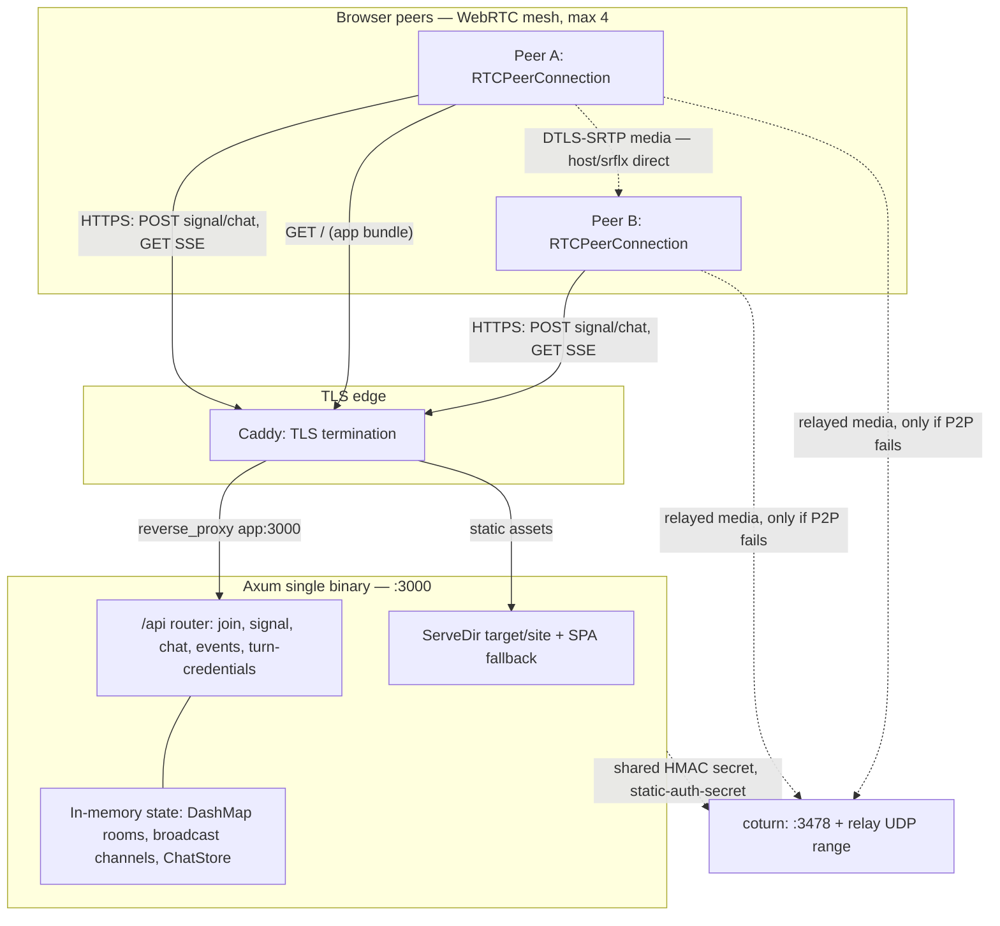
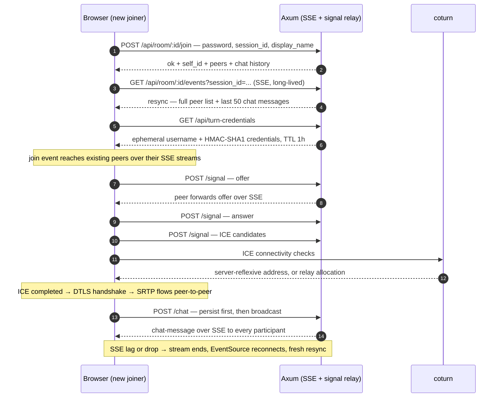

# Pico sized RTC chat Room

Explore the ability to create a really small and easy deployable chat and video chat system. This should be possible using WebRTC for most 
client side video handling, supported by a simple and light weight backend service.

Using modern standards and single binary rust (Axum + Leptos), SSE signaling, no WebSockets.

## Quick Start (Dev)

### Prerequisites

- Rust 1.85+ (edition 2024)
- [cargo-leptos](https://github.com/leptos-rs/cargo-leptos) — `cargo install cargo-leptos`
- [wasm32 target](https://rustwasm.github.io) — `rustup target add wasm32-unknown-unknown`
- `wasm-bindgen-cli` **matching the pinned `wasm-bindgen` version** in `Cargo.toml`
  (`=0.2.128`): `cargo install -f wasm-bindgen-cli --version 0.2.128`. cargo-leptos uses
  whichever `wasm-bindgen` is on `PATH`, and a schema mismatch fails the wasm build.
- [coturn](https://github.com/coturn/coturn) — `apt install coturn` (or Docker)

### Run Dev Server

```bash
# Builds the wasm client + Axum server, runs both, rebuilds on change.
# cargo-leptos also refreshes the browser tab for you (its own loopback reload
# server on :3001) — dev tooling only, never part of the app.
cargo leptos watch
```

Open http://localhost:3000, navigate to a room like `/room/my-test`, set a password, share the link.

One-shot alternative (build then run, no watching): `cargo leptos serve`.

The server binds the `site-addr` from `[package.metadata.leptos]` in `Cargo.toml`
(default `127.0.0.1:3000`) and serves the built client from `site-root`
(`target/site`, regenerated on every build — never hand-edit it).

### TURN (Optional for Dev)

For local testing on the same machine or same NAT, STUN alone is sufficient.
For testing across NATs:

```bash
# Edit turnserver.conf, then:
turnserver -c turnserver.conf
```

Or Docker:

```bash
docker run -d --network=host \
  -v $(pwd)/turnserver.conf:/etc/coturn/turnserver.conf \
  coturn/coturn
```

## Production Deployment

### Architecture

Two planes, deliberately kept apart: the server only ever touches **signaling and
chat** — media goes browser-to-browser, and touches coturn only when ICE decides
it must.

#### Topology



#### Signaling flow



### Build

```bash
# Client (wasm) + server binary in one invocation; output lands in target/site
cargo leptos build --release
```

To run the release server standalone (outside cargo-leptos), point it at the built
site — it reads these on startup and otherwise falls back to the same defaults:

```bash
LEPTOS_OUTPUT_NAME=webrtc-room \
LEPTOS_SITE_ROOT=target/site \
LEPTOS_SITE_ADDR=0.0.0.0:3000 \
./target/release/webrtc-room
```

The binary is named `webrtc-room` (matching the package name) because cargo-leptos
locates the built executable at `target/<profile>/<package-name>`.

### Deploy Checklist

1. **TLS is mandatory** — WebRTC requires a secure context (`https://`)
2. Place Caddy or Nginx in front of the Axum binary for TLS termination
3. Run coturn on the same host (or a nearby one) to minimize relay latency
4. Set environment variables:
   - `TURN_HOST` — public hostname of TURN server
   - `TURN_SECRET` — shared secret for ephemeral HMAC credentials (must match `static-auth-secret` in `turnserver.conf`)
   - `TURN_PORT` — usually `3478`
   - `LEPTOS_SITE_ADDR=0.0.0.0:3000` — the dev default binds loopback only, which is unreachable from inside a container
   - `LEPTOS_SITE_ROOT` / `LEPTOS_OUTPUT_NAME` — where the built client lives, and its file stem
5. Open UDP ports `3478` (TURN/STUN) and `49152-65535` (relay range) on firewall

### Docker Compose (Full Stack)

```yaml
services:
  app:
    build: .
    ports:
      - "3000:3000"
    environment:
      - TURN_HOST=turn.example.com
      # Must match `static-auth-secret` in turnserver.conf. Change both for production.
      - TURN_SECRET=dev-secret-change-me
      - TURN_PORT=3478
      # Where the built client is, and which address to bind (loopback would be
      # unreachable from the proxy container).
      - LEPTOS_SITE_ROOT=/srv/site
      - LEPTOS_SITE_ADDR=0.0.0.0:3000
      - LEPTOS_OUTPUT_NAME=webrtc-room
    restart: unless-stopped

  coturn:
    image: coturn/coturn
    network_mode: host
    volumes:
      - ./turnserver.conf:/etc/coturn/turnserver.conf
    restart: unless-stopped

  caddy:
    image: caddy:2
    ports:
      - "80:80"
      - "443:443"
    volumes:
      - ./Caddyfile:/etc/caddy/Caddyfile
      - caddy_data:/data
    restart: unless-stopped

volumes:
  caddy_data:
```

### Caddyfile

```
yourdomain.com {
    reverse_proxy app:3000
}
```

(Inside Docker Compose the app service is reachable as `app`; for a bare
host use `reverse_proxy localhost:3000`.)

### coturn Config (turnserver.conf)

```conf
listening-port=3478
realm=turn.yourdomain.com

# Auth — use use-auth-secret for ephemeral HMAC
use-auth-secret
static-auth-secret=change-me-to-random-hex

# Relay range
min-port=49152
max-port=65535

# IPs
external-ip=YOUR_PUBLIC_IP

# Logging
log-file=/var/log/turnserver.log
verbose
```

## Project Structure

A single crate holds both halves. cargo-leptos builds the `lib` target to wasm
(`--no-default-features --features=csr`) and the `webrtc-room` bin target
natively (`--no-default-features --features=ssr`), so `csr` and `ssr` never meet
in one compilation. There is no Trunk and no committed `index.html` — the server
writes the shell into `target/site` at startup.

```
pico-rtc/
├── README.md               # This file
├── Cargo.toml              # Crate + [package.metadata.leptos]
├── rust-toolchain.toml
├── turnserver.conf         # coturn config template
├── Caddyfile               # Reverse proxy template
├── Dockerfile
├── docker-compose.yml
├── src/
│   ├── lib.rs              # Module gates + the wasm `hydrate()` entry point
│   ├── types.rs            # Shared request/response/event types (both targets)
│   ├── app.rs              # Leptos <App> (wasm only)
│   ├── bin/
│   │   └── server.rs       # Axum main + the HTML shell it writes at startup
│   ├── pages/
│   │   ├── mod.rs
│   │   ├── home.rs         # Landing: enter room name
│   │   └── room.rs         # Video call UI
│   ├── server/
│   │   ├── mod.rs          # Router assembly + join/SSE/signal/chat handlers
│   │   ├── rooms.rs        # Room state, participant tracking
│   │   ├── chat.rs         # ChatStore trait + InMemoryChat ring buffer
│   │   ├── turn.rs         # Ephemeral TURN credential generation
│   │   └── auth.rs         # Room password check (trait for future auth)
│   ├── services/
│   │   ├── mod.rs
│   │   ├── signaling.rs    # Client: SSE consumer + signal sender
│   │   └── webrtc.rs       # Client: RTCPeerConnection wrapper
│   └── components/
│       ├── mod.rs
│       ├── video_tile.rs   # Single <video> element
│       └── controls.rs     # Mute/screen-share buttons
└── style/
    └── main.css            # Minimal custom styles on top of PicoCSS

Build output (gitignored): target/site/{index.html,pkg/*} for the site, and
target/front/ for the separate wasm target dir cargo-leptos uses.
```

## API Reference

All endpoints under `/api/`.

### `POST /room/:id/join`
Join (or claim) a room.

```json
// Request
{
  "password": "optional-existing-pw",
  "claim_password": "set-on-first-visit",
  "session_id": "uuid-from-sessionStorage",
  "display_name": "Alice",
  "user_id": "cookie-stable-id"
}

// Response
{"status": "ok", "self_id": "...", "peers": ["..."] , "chat": [...]}
{"status": "need-password"}        // room is new, you must set one
{"status": "password-required"}   // wrong password
{"status": "full"}                // room at capacity
```

### `POST /room/:id/signal?session_id=...`
Relay WebRTC signaling (offer/answer/ICE) to other peers. Requires the
`session_id` of an active participant (otherwise `400`/`403`).

```json
{"type": "offer", "sdp": "..."}
{"type": "answer", "sdp": "..."}
{"type": "ice-candidate", "candidate": "...", "sdp_mid": "...", "sdp_mline_index": 0}
```

### `GET /room/:id/events?session_id=...`
SSE stream. **Requires the `session_id` of an active participant** (as issued
by the join flow) — otherwise `400`/`404`/`403`. Event data (JSON, no
`event:` field — parse `data:`):

```json
{"event": "resync", "peers": [{"peer_id": "...", "peer_name": "Alice"}], "chat": [...]}
{"event": "peer-joined", "peer_id": "...", "peer_name": "Alice"}
{"event": "peer-left", "peer_id": "..."}
{"event": "offer", "from": "...", "sdp": "..."}
{"event": "answer", "from": "...", "sdp": "..."}
{"event": "ice-candidate", "from": "...", "candidate": "...", "sdp_mid": "...", "sdp_mline_index": 0}
{"event": "chat-message", "from": "...", "sender_name": "...", "text": "...", "timestamp_ms": 123}
```

A `resync` event (full room state: peers + last 50 chat messages) is sent on
every (re)connect, so clients can heal any gap after join or a reconnect.

### `POST /room/:id/chat?session_id=...`
Send a chat message (persisted, broadcast via SSE). Requires the `session_id`
of an active participant.

```json
{"text": "hello", "sender_name": "Alice"}
```

### `GET /room/:id/chat/history?session_id=...`
Last 100 chat messages for the room. Requires the `session_id` of an active
participant.

### `GET /turn-credentials`
Ephemeral TURN/STUN credentials (HMAC-SHA1 per TURN REST API spec, 1hr TTL).

```json
{"urls": ["turn:host:3478", ...], "username": "<expiry>:<id>", "credential": "<hmac>", "ttl_secs": 3600}
```

### Browser-side Identity

| Storage          | Key       | Purpose                                                   | Lifetime        |
| ---------------- | --------- | --------------------------------------------------------- | --------------- |
| Cookie           | `wr_uid`  | Stable UUID v4 per browser (future auth `sub`)            | 1 year          |
| Cookie           | `wr_name` | Display name                                              | 1 year          |
| `sessionStorage` | `wr_sid`  | Participant slot: the `session_id` sent to every room API | Until tab close |

`wr_sid` is deliberately *not* a cookie: it identifies one tab, not one browser,
so two tabs are two participants, while a reload re-joins with the same slot
instead of taking another one from the room's capacity.

## Future Roadmap

- [ ] SFU (mediasoup or custom) for >4 participants
- [ ] Reclaim a participant slot when its SSE stream ends — today a session is
      only replaced if it re-joins with the same `session_id`, so tabs that are
      closed leave ghost tiles behind until the room is restarted
- [ ] Data channels (collaborative drawing, reactions)
- [ ] JWT/OIDC auth replacing room passwords
- [ ] Recording (server-side or client-side MediaRecorder)
- [ ] Chat sidebar (over existing DataChannel)
- [ ] Screen share via simulcast layers
- [ ] Mobile PWA (web manifest + service worker)

## License

MIT
